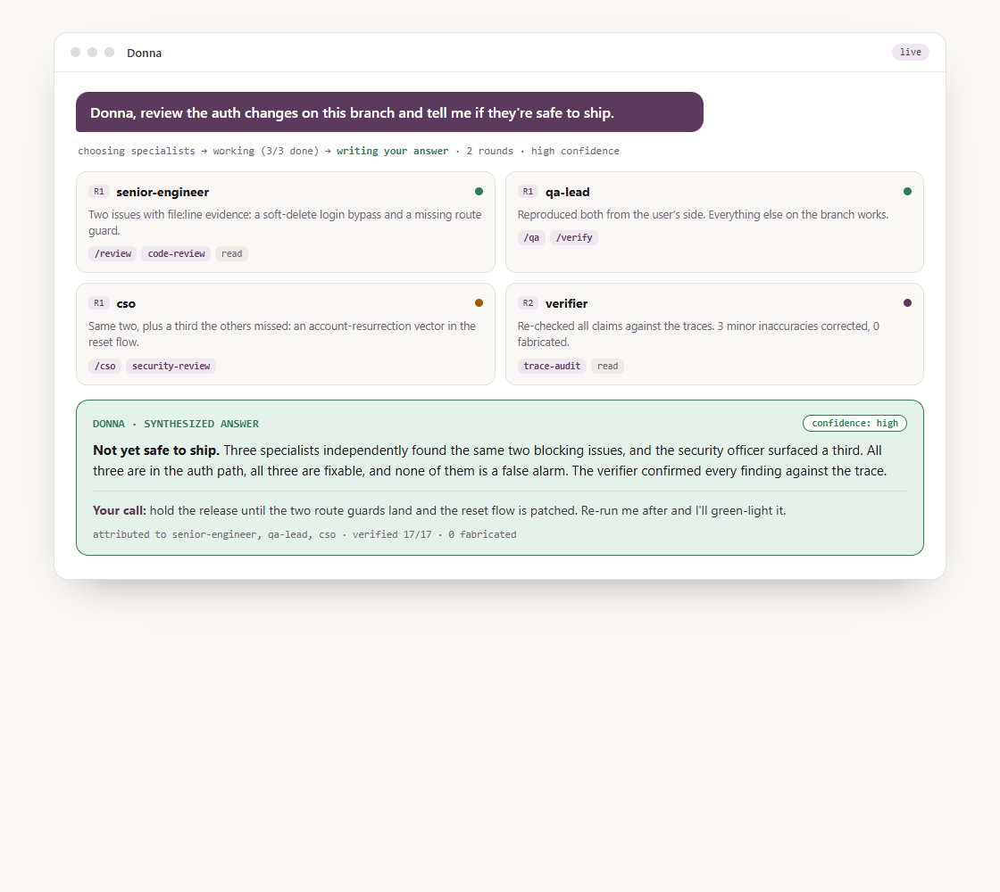
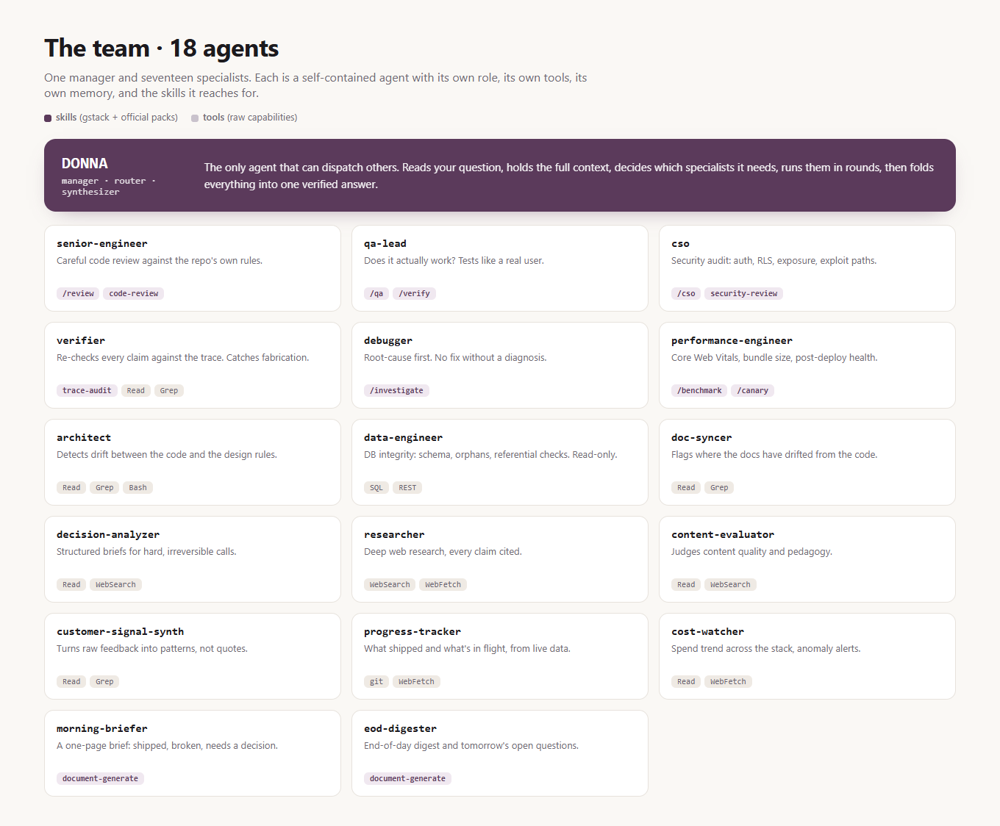

# Agent Orchestration Engine

**A manager-and-employees layer for Claude Code. One agent (Donna) routes your request to a team of specialist agents, runs them in parallel, verifies their work, and hands you back a single answer.**

**▶ [Read the full case study](https://khizerhussain02.github.io/agent-orchestration-engine/)** for the story, the architecture, and a real episode where the verifier caught the team's own mistakes.

Most AI coding setups are one assistant doing everything. Real teams don't work that way. They have a manager who knows *who* to ask, specialists who go deep, and someone who double-checks the work before it ships. Agent Orchestration Engine is that structure, expressed as [Claude Code subagents](https://docs.claude.com/en/docs/claude-code/sub-agents).

You talk to **Donna**. Donna decides which **specialists** the question needs, dispatches them (in parallel when she can), and **synthesizes one coherent answer**, after a **verifier** has checked their claims for confabulation. You can add your own specialists by dropping in a file, and shape each one's behavior by editing a template.

<p align="center">
  
</p>
<p align="center"><em>One question in, one verified answer out. The specialists work, the verifier checks them, and Donna gives you the call.</em></p>

> ⚠️ **This is an opinionated starting point, not a finished product.** It ships the *interactive* framework, the part that works the moment you open Claude Code in this folder. The optional always-on/autonomous mode (a background watcher and web dashboard) is on the [roadmap](#roadmap), not in this repo yet.

---

## The idea in one picture

```
                         you ask a question
                                │
                                ▼
                     ┌────────────────────┐
                     │       DONNA         │   the manager / router
                     │  (only she can      │   · picks who to involve
                     │   dispatch others)  │
                     └─────────┬──────────┘
              ┌────────────────┼────────────────┐
              ▼                ▼                ▼
      ┌─────────────┐  ┌─────────────┐  ┌─────────────┐
      │senior-eng…  │  │  qa-lead    │  │ researcher  │   … 17 specialists,
      │ (code rev.) │  │ (does it    │  │ (cited web  │   each with its own
      │             │  │  work?)     │  │  research)  │   skills + memory
      └──────┬──────┘  └──────┬──────┘  └──────┬──────┘
             └────────────────┼────────────────┘
                              ▼
                     ┌────────────────────┐
                     │     VERIFIER        │   checks every claim:
                     │  VERIFIED /         │   VERIFIED · UNVERIFIED · FABRICATED
                     │  UNVERIFIED /       │   (kills confabulation before
                     │  FABRICATED         │    it reaches you)
                     └─────────┬──────────┘
                              ▼
                     Donna synthesizes → ONE answer
```

**The loop:** `decide who → dispatch specialists (parallel) → verify → synthesize`. Donna runs it every time, in one or several rounds until she can answer with confidence.

---

> 📐 **Want the full picture?** The [**Architecture deep-dive**](docs/ARCHITECTURE.md) covers the runtime loop, the anti-confabulation verification layer, the end-to-end observability model, and the reliability engineering (crash recovery, process-tree kills, budget caps, atomic job-claiming).

## The team (18 agents)

**Donna** is the manager. The only agent that can dispatch others; she routes, orchestrates, and synthesizes.

<p align="center">
  
</p>

**The specialists, in text:**

| Engineering | Product & research | Ops & quality |
|---|---|---|
| `senior-engineer` · code review | `decision-analyzer` · decision briefs | `qa-lead` · does it actually work? |
| `architect` · drift/design | `researcher` · cited web research | `verifier` · anti-confabulation |
| `debugger` · root-cause (no fix w/o RCA) | `customer-signal-synth` · feedback→patterns | `cso` · security audit |
| `data-engineer` · DB integrity (read-only) | `content-evaluator` · content quality | `performance-engineer` · web vitals |
| `doc-syncer` · docs-vs-code drift | `progress-tracker` · activity data | `cost-watcher` · spend tracking |
| | | `morning-briefer` / `eod-digester` · daily briefs |

Each specialist is a self-contained `.claude/agents/*.md` file (its role, tools, and behavior) with its own append-only memory log.

---

## Quick start (works in ~30 seconds)

1. **Copy the framework into your project:**
   ```bash
   git clone https://github.com/<you>/agent-orchestration-engine.git
   cp -r agent-orchestration-engine/.claude/agents /your/project/.claude/agents
   ```
2. **Open your project in [Claude Code](https://claude.com/claude-code).**
3. **Ask Donna something that needs more than one specialist**, e.g.:
   > *"Donna, review the auth changes on this branch and tell me if they're safe to ship."*

   Watch her route it to `senior-engineer` + `cso` + `qa-lead`, run them, verify, and hand back one synthesized answer.

*(Optional: fill in the templates under `.claude/agents/context/` to give the team your product/team context, and they'll tailor every answer to your project.)*

---

## Extend it

- **Add a specialist** → drop a new `.claude/agents/<name>.md` (frontmatter + a role prompt). Add its name to Donna's roster in `donna.md` so she'll dispatch it.
- **Refine a specialist** → edit its `.md` template. That's the whole "tuning" surface.
- **Give the team context** → fill in the `context/` templates once.

## What this is / isn't

| It **is** | It **isn't** |
|---|---|
| A drop-in multi-agent framework for Claude Code | A hosted product or a chatbot |
| Interactive, works immediately | An always-on autonomous system (see roadmap) |
| Fully editable, every behavior is a template | A black box |
| Anti-confabulation by design (the verifier) | Guaranteed correct; it reduces, not eliminates, error |
| **Read-only & safe**, it observes and reports | An autonomous code-editor (write access is a deliberately gated roadmap item) |

## Inspiration & credit

Agent Orchestration Engine is inspired by [**gstack**](https://github.com/garrytan/gstack), [**Garry Tan**](https://github.com/garrytan)'s (President & CEO of Y Combinator) Claude Code skill pack, which put a beautifully simple idea into the world: stop using one AI as a solo developer, and give it a *role-based virtual team* instead.

Agent Orchestration Engine takes that idea and builds an **orchestration layer** on top of it:

- Where gstack gives you a set of role *skills* you invoke, Agent Orchestration Engine adds a **manager agent (Donna)** that decides *which* specialists a question needs and **dispatches them as parallel sub-agents** across iterative rounds.
- It adds a **verifier** that checks each specialist's claims for confabulation before you see them, and a **synthesis** step that folds everything into one answer.
- And it uses gstack's skills as the specialists' **power tools**. `senior-engineer`, `qa-lead`, `cso`, and others reach for gstack slash-commands to do their deep work.

So: the *"virtual team"* idea is Garry Tan's; the *manager-dispatches-specialists-then-verifies-and-synthesizes* orchestration on top is what we built and tuned for our own use.

## How we used it in production

Agent Orchestration Engine wasn't a demo. It was a real validation gate for a real product. The pattern we ran, day in and day out:

**After every push, Donna runs the full loop.** She dispatches the change to the specialists it actually needs: `senior-engineer` reviews the diff, `qa-lead` checks it genuinely works, `cso` looks for a security regression. They run **in parallel**, the `verifier` checks their claims for fabrication, and Donna comes back with **one green/red signal** before we trusted the change. A red from any specialist meant we looked again before moving on.

That's the whole point of the [read-only design](docs/ARCHITECTURE.md#7-safety-read-only-by-design): a second, multi-agent opinion on every change, at **zero marginal cost** (it runs on your existing Claude plan, not a metered API), that we could trust *precisely because* it couldn't touch the code, only report on it.

## Skills & credits

Several specialists reach for **skills**, reusable procedures that live *outside* this repo and are installed globally in Claude Code. Agent Orchestration Engine **references** them by name; it does **not** bundle anyone else's code.

- **[gstack](https://github.com/garrytan/gstack)** by Garry Tan, the skill pack Donna's team leans on most. `senior-engineer`, `qa-lead`, `cso`, `debugger`, `verifier`, and `performance-engineer` reach for gstack skills such as `/review`, `/qa`, `/cso`, `/investigate`, `/benchmark`, and `/canary`. **Install gstack for the specialists to reach full capability**, see [github.com/garrytan/gstack](https://github.com/garrytan/gstack).
- **Official Anthropic skills.** A few agents use skills like `code-review`, `security-review`, and `document-generate` / `document-release`.

**Without those packs installed, the affected specialists still run; they fall back to their own built-in reasoning** (a graceful degrade, not a crash). Donna's routing, the verify-then-synthesize loop, and every role's core judgment work with **zero external skills**.

> Think of it this way: the `.md` files here are the **team and their playbooks**. The external skill packs are the **power tools** they pick up, installed separately, like any developer's toolchain.

## Roadmap

- [ ] Autonomous mode: a background watcher that runs Donna headlessly on a queue
- [ ] Web dashboard for sessions, specialist calls, and memory
- [ ] Cross-project shared memory
- [ ] A specialist marketplace / starter packs

## License

MIT. See [LICENSE](LICENSE).

---

*Originally built by **Khizer Hussain** in 2025 and 2026 as the collaboration brain for a small human and AI team shipping a real product. Open-sourced here, generalized and scrubbed of all internal data, with the memory logs and context files shipped empty for you to make your own.*
